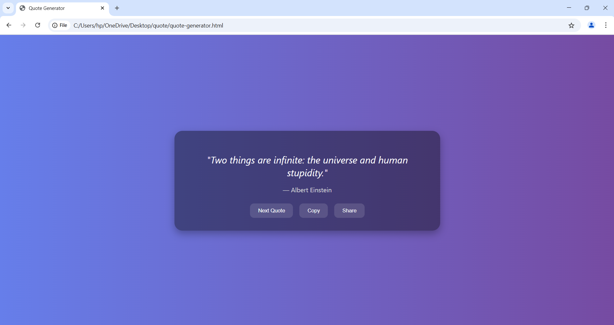

# 💬 Quote Generator

A simple and elegant web app that displays random inspirational quotes. Built using HTML, CSS, and JavaScript. Users can copy or share quotes with ease.

## 🚀 Features

- 🎲 Random quote display
- 🔁 "Next Quote" button for new inspiration
- 📋 Copy quote to clipboard
- 📤 Share quote (uses Web Share API if available)
- 🌙 Minimal and responsive UI
- ✅ Works completely offline (no API dependency)

## 🛠️ How to Run

1. **Download or Clone this Repository:**

```bash
git clone https://github.com/yourusername/quote-generator.git
```

2. **Open the `quote-generator.html` file in your browser**

> ✅ No setup required! The app uses local quotes and works offline.

3. *(Optional)* Run with a local server for development:
   - With Python:
     ```bash
     python -m http.server
     ```
     Then open `http://localhost:8000` in your browser.

   - Or use VS Code + Live Server extension.

## 📸 Screenshots




## 💡 Ideas for Future Features

- Save favorite quotes
- Dark/light theme toggle
- Download quote as image
- Add background images

---
